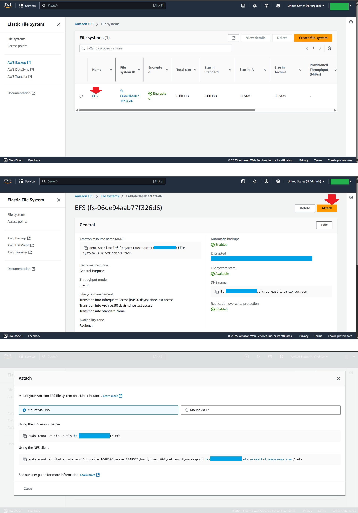
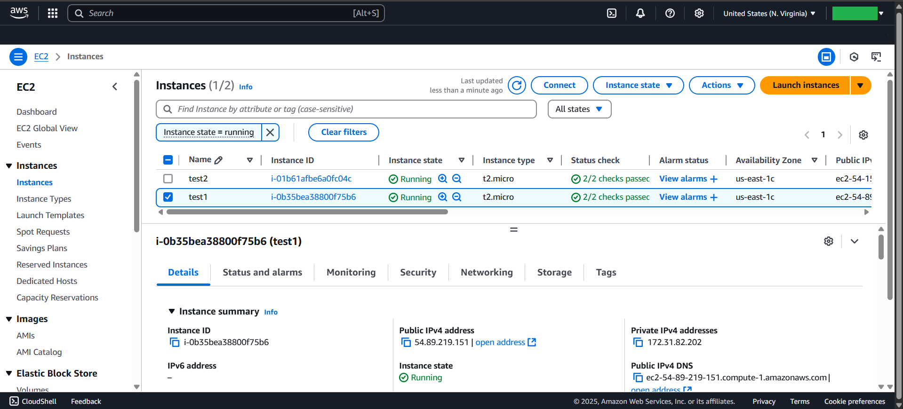
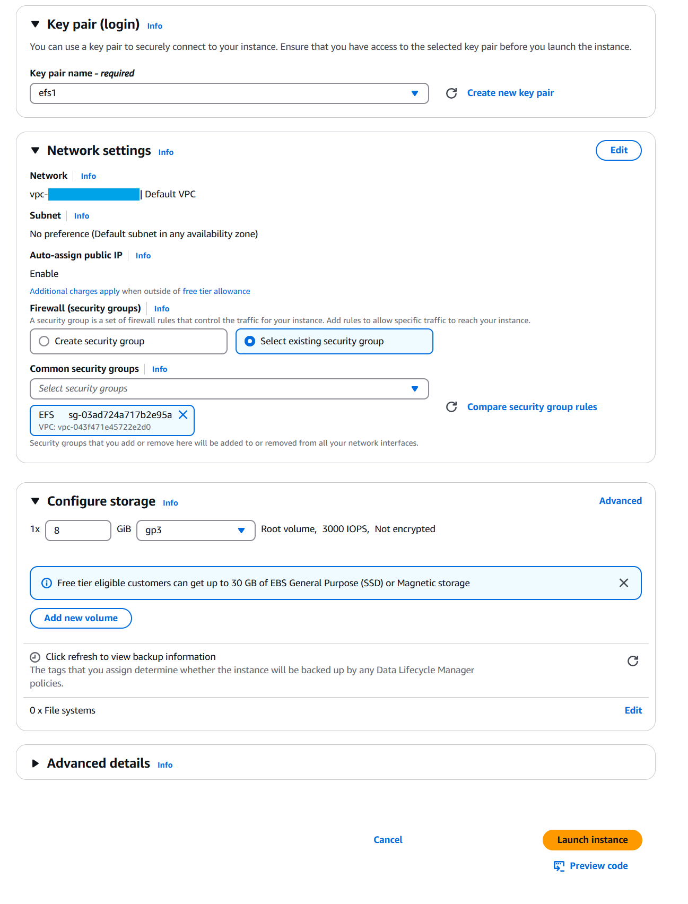
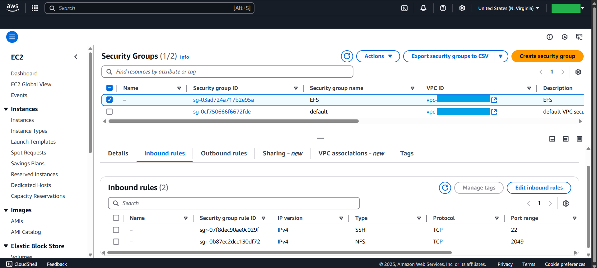
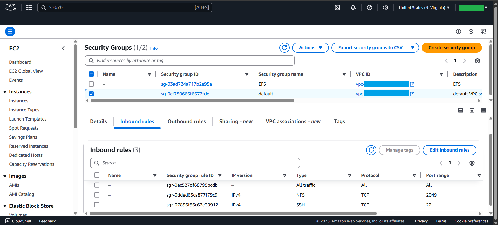
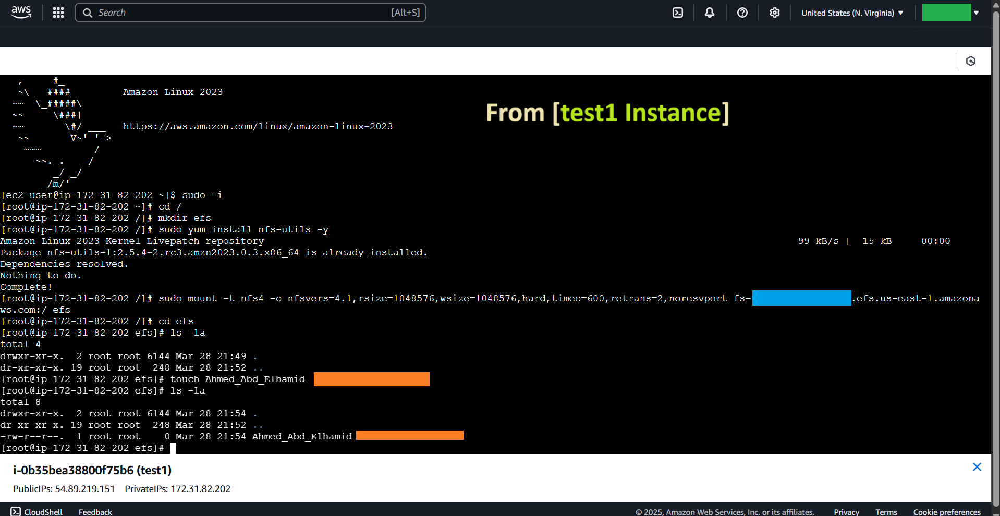
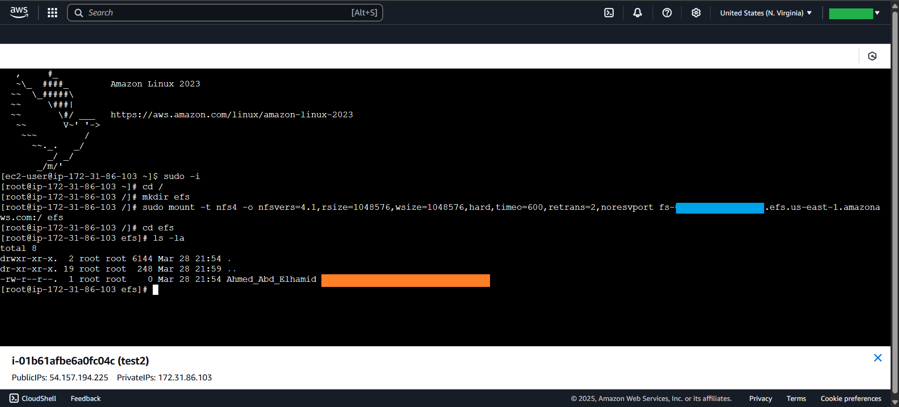

# 📘 Amazon EFS with EC2: Shared File Storage Setup

## 🚀 Overview
This guide walks through setting up **Amazon Elastic File System (EFS)** for shared file storage across multiple **EC2 instances**. You'll configure security groups, mount EFS on instances, and validate the setup.

## 📌 Architecture
### **1️⃣ Create Amazon EFS**
Amazon EFS provides a scalable, elastic, and highly available **network file system** for EC2 instances.



### **2️⃣ Launch & Configure EC2 Instances**
We create **two EC2 instances** that will share the same EFS.




## 🔐 Security Groups Configuration
### **3️⃣ Configure Security Groups for EC2**
The **NFS protocol** is bi-directional, so security groups must be properly set:

```bash
# NFS Protocol (Port 2049) must be allowed in both EC2 and EFS security groups
# When EC2 connects to EFS, it sends a request on port 2049
# For EFS to respond, inbound connections on port 2049 must also be allowed
```



### **4️⃣ Configure Security Groups for EFS**
```bash
# Allow inbound connections on port 2049 for NFS communication
# Ensure EC2 instances can access EFS
```



## 🔗 Mounting EFS on EC2
### **5️⃣ Mount EFS on EC2 (Instance 1: test1)**
```bash
sudo -i
cd /
# Create a directory to serve as the mount point
mkdir efs

# Install required NFS utilities
sudo yum install nfs-utils -y

# Optional: Install Amazon EFS utilities (recommended for mounting EFS)
sudo yum install amazon-efs-utils -y

# Mount the EFS file system to the EC2 instance
sudo mount -t nfs <EFS-DNS>:/ efs

# Verify data access
cd efs
ls -la
```



### **6️⃣ Mount EFS on EC2 (Instance 2: test2)**
```bash
sudo -i
cd /
# Create a directory to serve as the mount point
mkdir efs

# Install required NFS utilities
sudo yum install nfs-utils -y

# Mount the EFS file system to the EC2 instance
sudo mount -t nfs <EFS-DNS>:/ efs

# Verify data access
cd efs
ls -la
```



## 🎯 Summary
✅ **EFS is created and configured**
✅ **Two EC2 instances are set up**
✅ **Security groups allow bi-directional NFS traffic**
✅ **EFS is successfully mounted on both instances**

## 📚 Additional Resources
- [AWS EFS Documentation](https://docs.aws.amazon.com/efs/latest/ug/)
- [AWS Security Groups Guide](https://docs.aws.amazon.com/vpc/latest/userguide/VPC_SecurityGroups.html)

---
🛠 **Author:** Ahmed Abd Elhamid |  🌍 **Project:** AWS EFS + EC2 Automation

